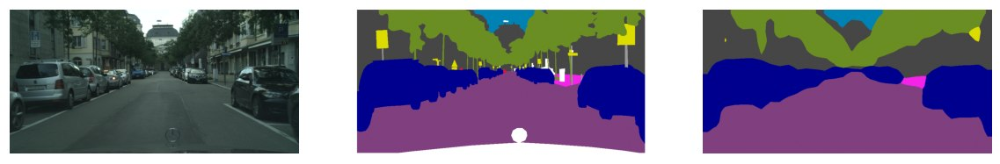

## Federated Semantic Segmentation
### Advanced Machine Learning - Polito
The process of semantic segmentation is crucial in making self-driving vehicles autonomous by allowing them to identify different objects within their surroundings by assigning pixels to specific categories. However, this process uses sensitive data collected from cars, making the protection of user privacy a top priority. To address this concern, an approach called Federated Learning has been proposed to learn a global model while keeping data private  and utilizing data from multiple remote devices. In this study, a Federated Learning method was applied to semantic segmentation in self-driving cars using the BiSeNet [1] model. Experiments were conducted using the Cityscapes dataset, and a method to consider data privacy for individual users in real-world scenarios was proposed by using various techniques such as Federated Averaging, Fourier Domain Adjustment, and the creation of pseudo-labels. 

